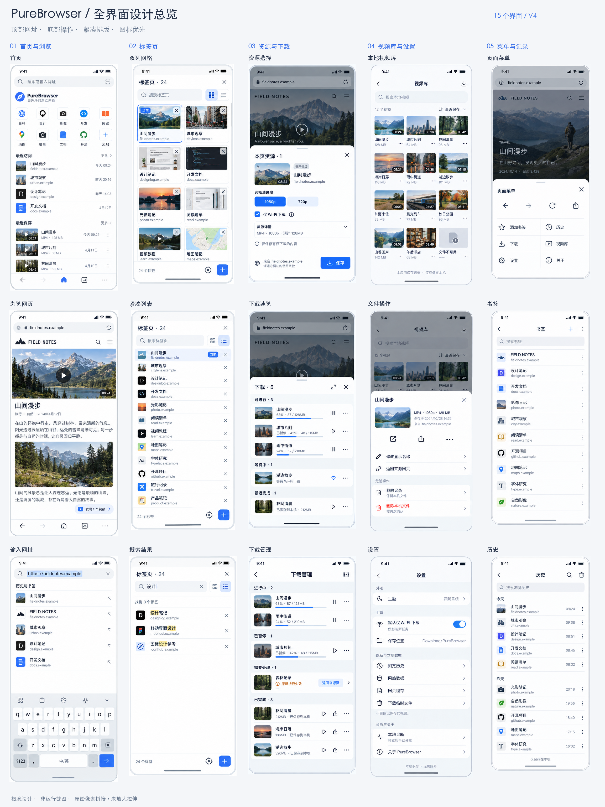
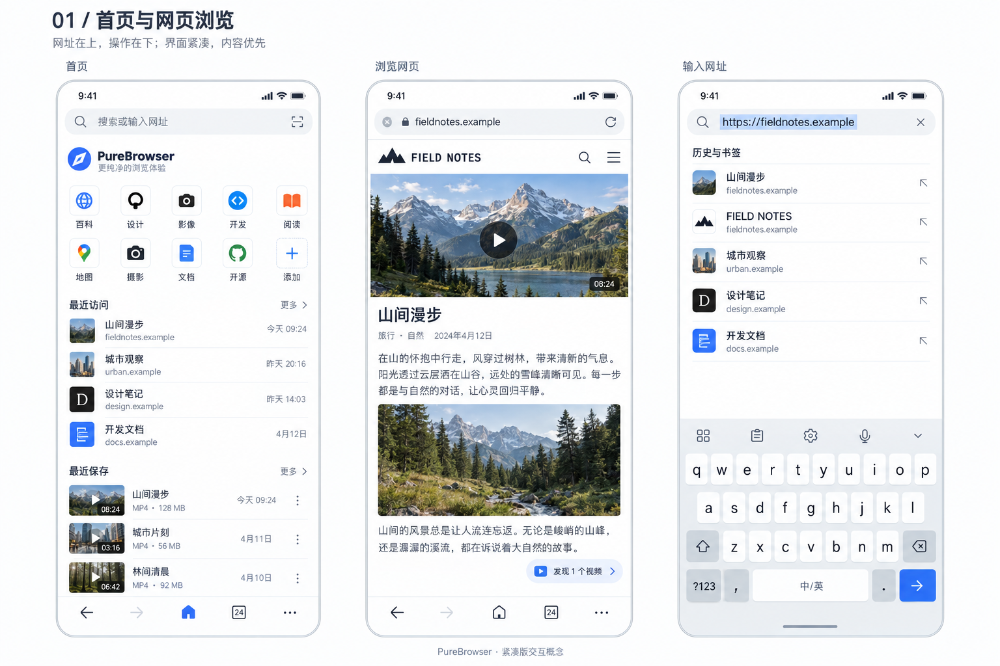
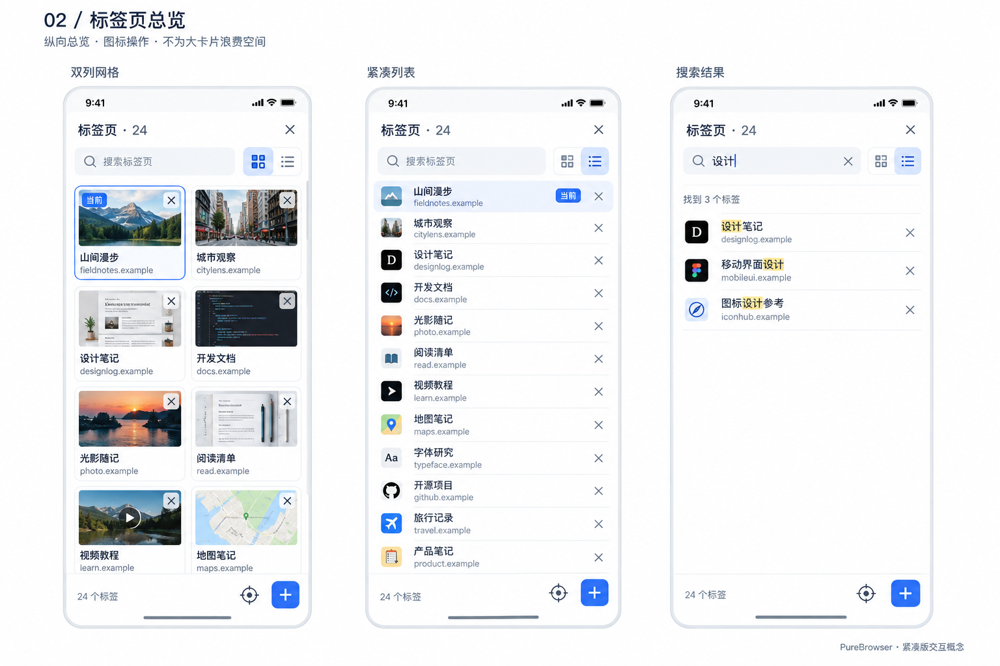
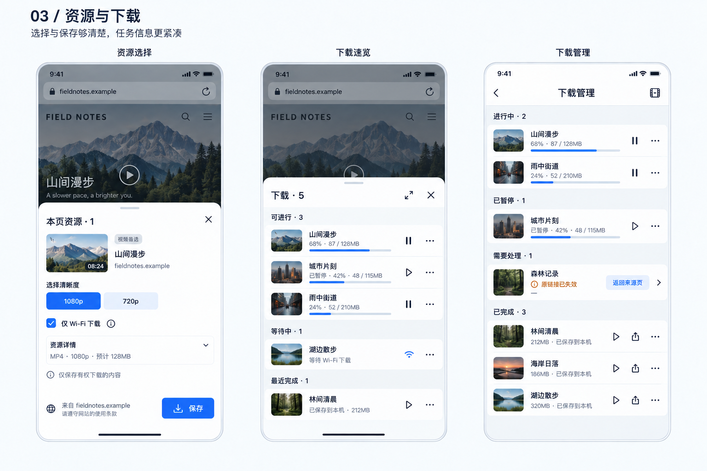
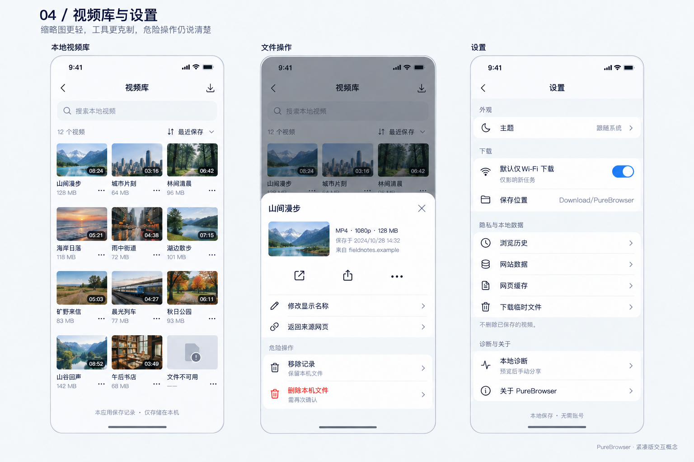
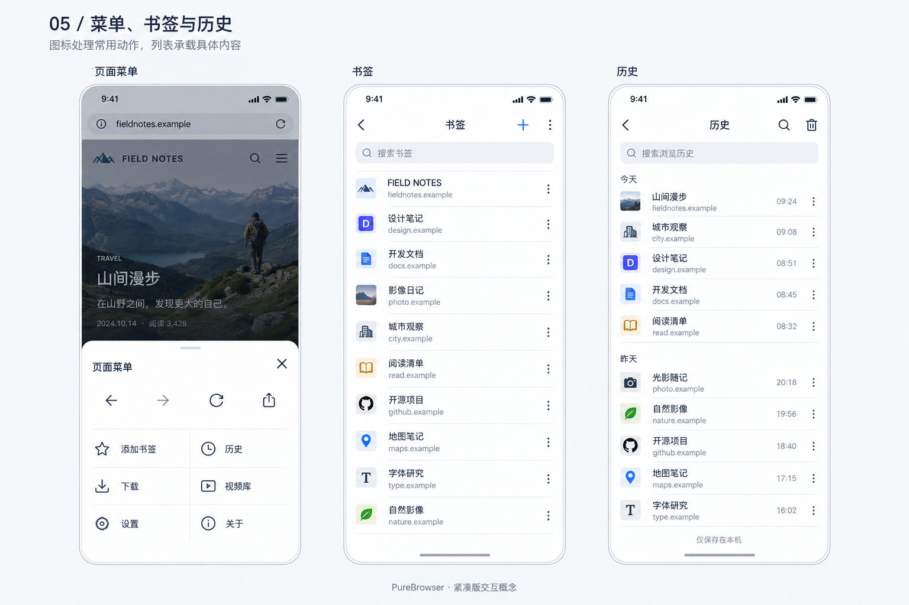

# PureBrowser UI 设计方向：紧凑版 V4

- **整理日期**：2026-10-03（Asia/Shanghai）。
- **状态**：用户基本认可的设计方向，供后续 UI 迭代使用；不是已实现界面，不是发行验收结果。
- **本次范围**：归档最终 5 组图稿、15 个界面状态及完整总览，记录设计取舍和交互约束；不修改应用代码、下载引擎、数据结构或版本号。
- **实现基线**：整理时本地提交为 `967d290`，分支为 `feat/v0.1.3`。实际功能与候选边界仍以 [当前实现状态](../../history/IMPLEMENTATION-STATUS.md) 为准。

## 1. 结论与阅读顺序

> **顶部展示网址，底部集中常用操作；浏览是主体，工具按需展开；界面紧凑，但不牺牲可读性、点击区域或危险操作的明确性。**

1. 先看下方总览，理解各页面之间的视觉关系。
2. 再看第 4 节分组图与第 5 节交互规则；图片不是精确尺寸或完整状态规格。
3. 开始实现前，逐项确认 [实现与验收清单](IMPLEMENTATION-CHECKLIST.md)。
4. 图片来源、像素尺寸、校验信息见 [素材说明](assets/README.md) 和 [素材清单](assets/manifest.json)。

发生冲突时，优先级为：**现有业务与安全边界 → 本文明确规则 → 概念图中的示意表现**。图稿中偶然生成的图标、文案、日期和元信息，不构成新增功能需求。

## 2. 已确认方向与探索过程

| 议题 | 最终方向 | 未采用／被替代的方向 |
| --- | --- | --- |
| 视觉基调 | 冷灰底色、蓝色强调，低装饰、紧凑排版 | 只改变配色的多套皮肤；大字、大图标、大按钮主导的展示稿 |
| 主交互 | 以 A 的轻量浏览、底部工具入口为基础 | 网页工作台主导；网页与资源常驻双区 |
| 地址栏 | 独立放在顶部，平时展示当前网站，点按编辑 | 早期 A 的底部地址栏；输入栏跟随键盘上移 |
| 底部导航 | 返回、前进、首页、标签页、菜单等清晰的图标动作 | 把地址输入和所有功能都堆在底部 |
| 标签页总览 | 接近全屏、纵向双列网格；可切列表、搜索 | 逐张左右滑动的大卡片抽屉 |
| 定位当前标签 | 仅保留定位图标，不显示“定位当前”文字 | 图标旁再配整段按钮文字 |
| 信息密度 | 较小的视觉图标、普通字号、更紧凑的列表与间距 | 对所有控件和操作都使用大卡片、大号文字 |
| 动作表达 | 含义明确的常用动作优先图标化 | 把所有动作都做成带文字的大按钮；把危险操作也完全图标化 |
| 工具承载 | 临时操作用抽屉，复杂管理使用完整页面 | 为了统一外观，强迫所有功能只占半屏 |

### 确认程度

- **已确认**：上述整体方向、顶部地址栏、紧凑比例、图标优先、纵向标签总览和纯图标定位按钮。
- **设计建议，待实现验证**：标签顺序与定位策略、搜索细节、记忆网格／列表偏好、抽屉高度、具体列数、关闭后的撤销反馈等。
- **未纳入本轮**：深色主题完整图稿、横屏／平板／折叠屏布局、动效参数、所有空态／异常态、真实网页兼容性与性能验收。

## 3. 完整总览

总览为 **2304 × 3072**，按原始像素裁切拼接 15 个界面，没有对小图进行放大拉伸。每列对应一组功能，自上而下阅读。

## 4. 分组图与页面职责

### 4.1 首页、浏览网页、输入网址

- **首页**：顶部只有一个地址／搜索入口；常用站点、最近访问、最近保存是内容入口，不把首页做成大型功能仪表盘。
- **浏览网页**：顶部展示当前网站，底部为常用导航；发现资源后用轻量提示引导打开面板，不自动创建下载。
- **输入网址**：点按顶部地址栏进入编辑，建议结果在其下方展开；键盘出现时隐藏底部导航，不创建第二个输入栏。

### 4.2 标签页：网格、列表、搜索

- 由底部标签按钮进入；总览从底部展开到接近全屏，不为背景预览浪费大量高度。
- 网格以短缩略图配标题／域名；列表以图标、标题、域名提高同屏可见量。
- 网格／列表切换、新建标签和定位当前使用独立图标；点击条目切换网页，点击关闭图标关闭该标签，两个操作区不能混淆。
- 图中的 24 个标签、8 张卡片、12 行列表只是密度示例，不是固定容量或跨设备排版要求。

### 4.3 资源选择、下载速览、下载管理

- **资源选择**：先展示候选与实际可用方案，再由用户确认保存。只有确有多档位时才出现画质选择，不默认所有资源都有 1080p／720p。
- **下载速览**：浏览中的临时面板；暂停、继续、播放、更多使用图标，提供进入完整管理页的入口。
- **下载管理**：完整页面按任务状态组织信息；错误需有具体原因和下一步，不用统一“重试”替代所有恢复路径。
- 抽屉打开时，背景网页及顶部地址栏变暗，底部浏览工具栏隐藏，不叠出多套工具栏。

### 4.4 视频库、文件操作、设置

- **视频库**：以紧凑缩略图展示成品，保留标题、时长与可用性信息。三列为当前手机概念图示例，窄屏或大字体下应减少列数。
- **文件操作**：打开、分享等明确动作可图标化；显示名称修改、来源跳转保留必要说明。
- **移除记录／删除文件**：始终区分“保留本机文件”和“删除实际文件”，不得只凭图标或颜色区分；删除实际文件须再次确认。
- **设置**：外观、下载、本地数据、诊断与关于分组；保存目录在本轮中仅展示，不因图中布局而新增目录选择器。

### 4.5 页面菜单、书签、历史

- **页面菜单**：常用页面动作采用紧凑图标；书签、历史、下载、视频库、设置等分类入口保留名称。
- **书签**：以用户主动保留的网页为对象，不与最近访问混合。
- **历史**：按访问时间组织；清理操作要说明范围并确认，不默认同时清理书签、网站登录或视频文件。
- 专用管理页使用返回导航，不强制保留网页地址栏或完整浏览工具栏。

## 5. 交互规则与待验证建议

### 5.1 地址栏与输入

1. 展示态以可辨认的域名为主；不得因省略方式让用户误认当前网站。编辑态展示完整网址，保留明确的复制／修改路径。
2. 同一时刻只有一个地址输入控件；首页、网页和键盘状态保持顶部位置一致。
3. 搜索建议优先考虑本地历史和书签；不因概念图增加联网联想、上传历史或后台查询。
4. 建议返回顺序为先退出键盘／输入态，再回到浏览导航；具体焦点和返回键行为必须用真机或模拟器验证。
5. 本轮未确定滚动时自动隐藏地址栏，也未确定底部手势切页；不作为默认实现任务。

### 5.2 标签总览

1. **建议**保持稳定的标签顺序，切换网页不自动重排；进入总览时让当前标签处于可见范围。
2. **建议**记忆网格／列表偏好，不根据标签数量突然改变视图。
3. 搜索按标题／域名筛选当前已打开标签，不混入历史、书签或已关闭标签；无结果、清空搜索和当前标签被过滤时的行为需补齐。
4. 定位按钮不显示常驻文字，但应提供无障碍名称；长按提示是可选补充，不能代替无障碍语义。
5. **建议**关闭后提供短时撤销；最后一个标签关闭、关闭当前标签、批量关闭均需另行定义，图稿并未确认批量管理需求。
6. 点击结果返回对应网页并保留网页状态；避免仅为了截图或切换视图重新加载网页。

### 5.3 抽屉与页面

- 菜单、资源选择、下载速览、文件操作属于临时工具；不采用常驻双区布局。
- 底层网页在模态工具打开时不可误触；一次只显示一层有效工具面板，面板切换不层层堆叠。
- 标签总览可接近全屏；下载管理、视频库、书签、历史、设置使用完整页面。
- 关闭临时工具后，应恢复原网页及阅读位置；按系统返回优先退出当前输入／工具层，避免误关标签或直接退出应用。
- 键盘、系统手势区、横屏、大字体与小高度窗口不允许把确认按钮或列表操作挡住。

### 5.4 紧凑与可访问性

以下是**后续实现的初始试验值／验收目标，不是从图片测得的尺寸，也不是已确定的统一主题参数**：

| 项目 | 初始建议 |
| --- | --- |
| 强调色／背景 | 蓝 `#356DE8`；浅底 `#F3F5F8`；白色内容面 |
| 文字／分隔 | 深色 `#243047`；次要信息 `#64748B`；细分隔 `#E1E6EE`，实际对比度另行校验 |
| 字级 | 正文约 14sp、页面标题约 18sp 起试；次要元信息不能承载唯一关键状态，不把概念图中的小字直接当作下限 |
| 视觉图标 | 约 18–20dp 起试，统一线条与语义，不等于实际点击区域大小 |
| 点击区域 | 首轮以至少 48dp 的有效点击目标验收；通过内边距或父布局承载，不用挤压相邻动作达成表面密度 |
| 间距／圆角 | 4／8／12／16dp 间距层级；较小圆角与细分隔替代大面积胶囊卡片 |
| 自适应 | 字号放大、窄窗口时降低列数或行密度；不能锁定字体缩放，也不能固定一屏必须放下多少项 |

确认、删除、来源与错误说明保留文字；图标控件需要有名称、选中／禁用／执行中状态和焦点反馈。触控目标、字体缩放和对比度均须在实现中验证，静态图不能证明它们合格。

## 6. 不得因 UI 改版改变的业务边界

术语沿用 [项目词汇表](../../../CONTEXT.md)，不重新定义下载或成品语义。

- **发现不等于可下载**：资源线索、视频候选、下载方案、任务和成品分开呈现；不得把候选发现提示当成保存成功。
- **明确确认后下载**：权限、网络偏好、来源上下文和所选档位仍由真实业务状态决定；不因弹层精简而跳过必要步骤。
- **HLS 与直链不强行统一**：现有解析、准备、选择档位及确认流程不能只剩图里的两个画质按钮。
- **动作由能力控制**：暂停／继续／取消／重新下载按真实任务能力展示；封装、校验、发布等阶段不可因统一图标而获得虚假的可暂停能力。
- **错误分类来自证据**：失效链接、网络错误、文件不可用等不可统一写成“原链接已失效”；失败后的下一步必须与真实原因匹配。
- **完成不只看进度**：字节获取、封装、格式初检、发布和文件可用性不合并成一个含糊的“100%”。
- **视频库不是系统媒体扫描器**：仍以应用记录和实际文件可用性为依据；外部播放器／分享路径不因播放图标而被替换成新内置播放器。
- **隐私边界保持**：不新增账号、云同步、遥测、云解析；数据分项清理、诊断预览与手动分享保持原有明确授权语义。

## 7. 图稿阅读限制

1. 所有站点、标题、封面、日期、时长、文件大小、百分比和数量均为示例；生成图中同名条目的元数据不保证跨图一致。
2. 站点商标、应用标志和小图标为占位表现；不直接从图中切出作为正式应用素材。
3. 首页地址栏右侧类似扫描的符号、浏览地址栏中的多余小符号等属于生成偏差，**不代表加入扫码或新快捷功能**。
4. 图中的锁形图标不能被解释为对网站可信或内容安全的保证；来源展示与站点信息入口需另行定义。
5. “暂无资源”、页面加载失败、无网络、搜索无结果、下载不可恢复、存储不足和长文本等状态尚未完整出图，必须在实现前补齐。
6. 表面图标尺寸、圆角和面板高度仍有生成差异，实施时建立统一组件，不逐图硬编码。
7. 概念图没有验证性能、WebView 生命周期、TalkBack、系统返回、字体缩放、真实文件动作或多设备适配。

## 8. 下一步

2026-10-03 已根据本设计另行整理 [v0.1.4 版本与执行计划](../../history/EXECUTION-PLAN-V0.1.4.md) 与 [发行验收台账](../../history/RELEASE-ACCEPTANCE-V0.1.4.md)，当前均待实施。原设计确认程度不变，新增交互默认值在版本计划中明确标为建议。

按 [实现与验收清单](IMPLEMENTATION-CHECKLIST.md) 分步推进；先验证浏览外壳与标签总览，再迁移资源／下载和视频库等页面。不通过本次文档提交承诺目标版本，不提前把对应功能标记为完成。
