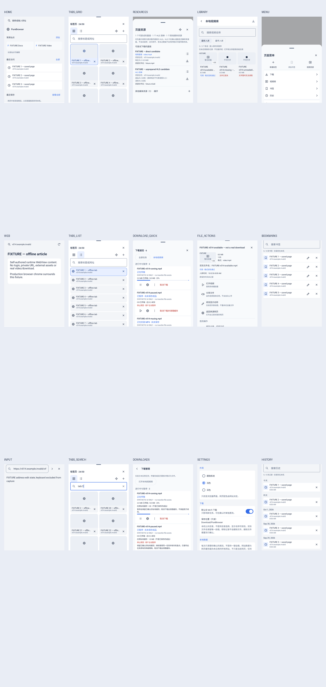

# v0.1.4 真实运行 UI 对照

这些是 Android 设备实际渲染的生产 Compose 组件截图，不是生成图、HTML 仿图或绘制的 UI mockup。
**页面内容均为明确标注的 FIXTURE 合成状态；不会证明图里的任务真的下载成功或文件存在。** 网页为自制离线 HTML，不含私人网址／登录／真实媒体；真实工作流、成品和升级由独立验收验证。

- 15个手机原生浅色状态，取自 API28 上的独立参数化子集，15/15通过、无跳过；窗口／源码输入／字体／APK身份见 `manifest.json`。
- 另有15状态×浅／深／320dp大字／600dp低高度共60个可视化用例在宽窗口上通过，原始报告保留在本地构建目录。
- 约束组件窗口不是 OS 分屏；模态工具使用其真实原生窗口。输入场景截图隐藏IME，不能冒充系统键盘验证。OS字体、键盘、返回和真实网页状态另有专项。
- PNG 保留原始设备裁剪像素；下方总览只缩小拼版供阅读，不作为精确尺寸规范。

## 与 V4 概念图的取舍

1. 顶部网址／底部五动作、冷灰／蓝色、纵向标签总览、轻量工具／完整管理职责保持。
2. 手机标签默认双列、视频库通常三列；按真实窗口／字体降列，不固定概念图的行数、24标签或三列。
3. 概念商标、品牌图标、山景封面、日期／时长／进度不是正式素材；本次用自制内容和占位验证布局，不切图冒充网页／视频。
4. 下载阶段、未知大小、真实恢复能力、文件不可用与危险操作的文字完整保留；不会为了“紧凑”制造假进度或取消确认。
5. 图标视觉尺寸20dp与点击区48dp分开；没有完整页面撤销、批量关标签、扫码、目录选择或内置播放器。
6. 深色补齐相同组件；大字体／低高度允许滚动和降低密度，不锁定字体或强求一屏塞下所有内容。

截图和概念图都不等于全机型、网站或 OEM 性能认证。
